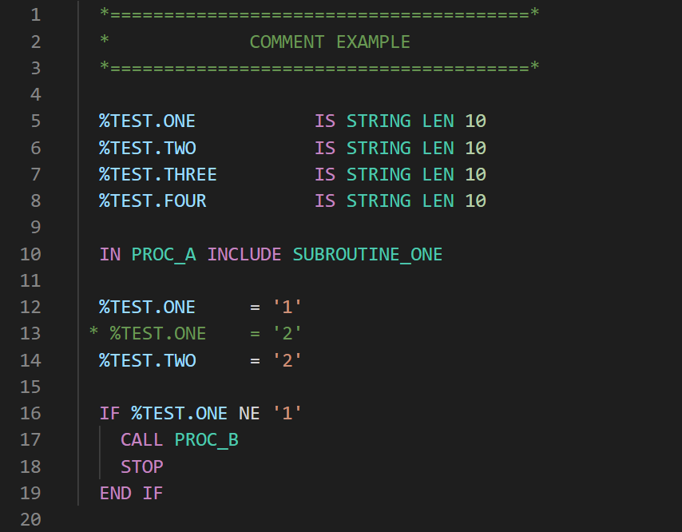

# M204 Language Extension

This VS Code extension can be used to add syntax highlighting for M204 source code exported in .txt format for easier reading.

## Features

Primarily includes highlighting for comments, variables, strings, and keywords.

## Requirements

- [VS Code](https://code.visualstudio.com/) installed
- M204 procedures saved in .txt format

## Install the extension

- This extension is not yet published on the marketplace, so to start using the extension with Visual Studio Code: download this repo, copy it into your `<user home>/.vscode/extensions` folder and restart VS Code.

## Local Development

1. Clone this repo
2. Confirm you have [npm](https://www.npmjs.com/get-npm) installed
3. In a terminal from the parent folder, run `code M204-language-extension` to open the extension code folder in VS Code
4. In VS Code, open the Terminal and run `npm install`
5. Hit F5 to debug the extension
6. It opens a new VS Code window, with [Extension Development Host] in the header. Use this window to open your M204 .txt files and you should see the syntax highlighting

To make changes to the highlighting rules, you can edit the grammar defined in **syntaxes/m204.tmLanguage.json**. After saving your changes, if you are debugging, click the restart arrow (or Ctrl-Shift-F5) to see them reflected in your Dev Host window.

## Release Notes

### 0.0.1

Initial release of the language extension
